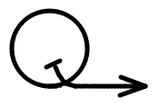

#   **CerQall**

A **CerCall** companion library for **Qt**

This library is an add-on library for CerCall. It provides a TCP transport implementation for CerCall, using the Qt Network component as the underlying
I/O library.

The code has been extracted into a separate library to make it available
under a license that is compatible with the Qt license model.
